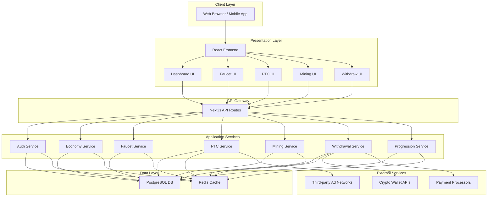

# System Architecture Diagram

## Component Descriptions

### Client Layer
- **Web Browser / Mobile App**: User interface layer where users interact with the platform

### Presentation Layer
- **React Frontend**: Main application frontend built with React/Next.js
- **Dashboard UI**: Shows user statistics, balances, and activity
- **Faucet UI**: Interface for claiming faucet rewards
- **PTC UI**: Paid-to-click advertisements interface
- **Mining UI**: Virtual mining simulation interface
- **Withdraw UI**: Cryptocurrency withdrawal interface

### API Gateway
- **Next.js API Routes**: Handles all API requests to backend services

### Application Services
- **Auth Service**: Manages user registration, login, and authentication
- **Economy Service**: Handles token balances, conversions, and transactions
- **Faucet Service**: Manages faucet claim timing and rewards
- **PTC Service**: Processes paid-to-click advertisements and rewards
- **Mining Service**: Implements virtual mining algorithms and pool management
- **Withdrawal Service**: Handles cryptocurrency withdrawal requests and processing
- **Progression Service**: Manages user levels, XP, and achievements

### Data Layer
- **PostgreSQL DB**: Primary database for storing user data, transactions, and activities
- **Redis Cache**: Caching layer for session management and rate limiting

### External Services
- **Crypto Wallet APIs**: Interfaces with cryptocurrency networks for withdrawals
- **Payment Processors**: Third-party payment processing services
- **Third-party Ad Networks**: External advertising platforms for PTC system